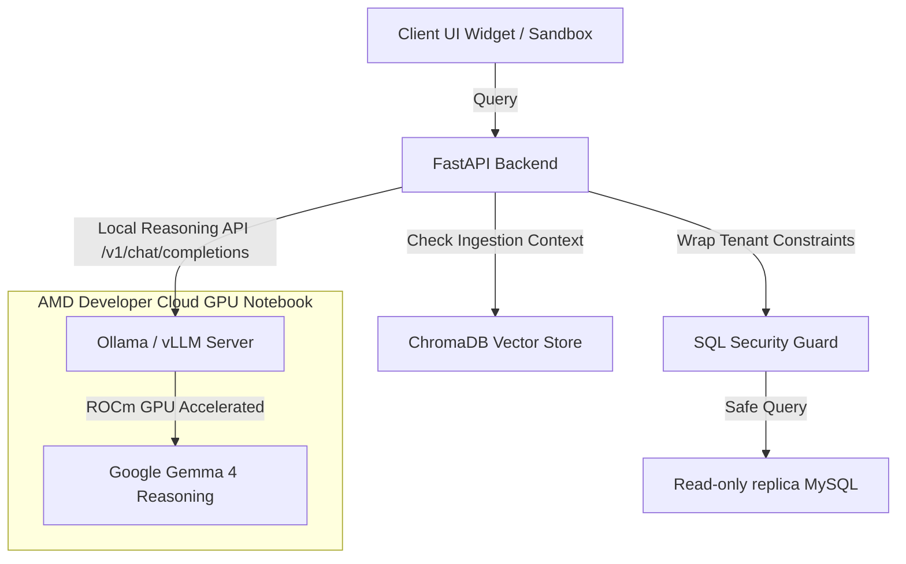

# Technical Integration Guide: local Gemma & AMD ROCm GPU

This document provides a detailed overview of the local **Gemma 4** model integration optimized to run on **AMD Developer Cloud GPUs** using **ROCm** with **Ollama** or **vLLM** for ZeroTicket.

---

## 🏗️ How the Integration Works

ZeroTicket supports a hybrid, privacy-first deployment architecture where code reasoning and database querying run entirely on local AMD GPU compute cards, ensuring 100% data privacy.



---

## ⚡ Smart Ingest & Reasoning Fallbacks

To ensure smooth operation even on specialized GPU nodes, the backend implements local-to-cloud fallback rules:

1. **Embedding Generation Fallback:** When indexing your codebase, if your local server does not run an embedding model or the connection to `nomic-embed-text` fails, the backend automatically falls back to `gemini-embedding-001` (using `GEMINI_API_KEY`) so ingestion completes successfully.
2. **Multimodal Vision OCR Fallback:** Local Gemma models typically do not support image inputs. If a user uploads an error screenshot and your provider is set to AMD Local GPU, the backend routes the screenshot to Gemini for high-quality OCR text extraction, then feeds the extracted text context into local Gemma's text reasoning chain.
3. **No-API-Key Bypass:** Local Ollama/vLLM servers do not require authentication headers. The backend relaxes key verification when the AMD provider is selected, removing the need to save dummy credentials.

---

## 🖥️ User Interface Tour

The settings drawer in your Developer Console has been customized:
* **AI Provider:** Choose **AMD GPU (Local Gemma)** to route all reasoning requests locally.
* **Model Name:** Quick presets are available for **Gemma 4** (`gemma4`, `gemma4:12b` for multimodal, `gemma4:31b` for reasoning), **Gemma 2**, and **Llama 3**.
* **Base URL:** Enter your custom local endpoint (e.g. `http://<IP>:11434/v1` for Ollama or `http://<IP>:8000/v1` for vLLM).
* **ROCm Status Dot:** A live status dot beside the model name checks connection health:
  * 🟢 **Green (Online):** Connection established, GPU node is reachable.
  * 🔴 **Red (Offline):** GPU node is unreachable or offline.
  * 🟡 **Pulsing Yellow (Checking):** Health check in progress.

---

## 🧪 How to Run and Test Right Now

Follow these step-by-step instructions to verify the setup:

### Step 1: Start your AMD Developer Cloud GPU Notebook
1. Open the AMD Developer Cloud portal and request your GPU notebook instance.
2. Once active, note the public IP address or open the notebook terminal.

### Step 2: Launch the Model Server on the GPU Notebook

#### Option A: Run via Ollama (Recommended & Simple)

1. **Prerequisites & Setup:**
   If installing via the automated curl script fails due to network throttling, download and upload the package manually:
   - Download the package locally: [Ollama Linux x64 Zstd Archive](https://ollama.com/download/ollama-linux-amd64.tar.zst)
   - Click the **Upload Files (Up Arrow)** button in JupyterLab's sidebar and upload it to the `/workspace` folder.
   
2. **Decompress and Extract:**
   Run these commands in your notebook terminal to install it:
   ```bash
   # Install zstd decompression tool
   apt-get update && apt-get install -y zstd
   
   # Decompress the archive
   zstd -d ollama-linux-amd64.tar.zst
   
   # Extract into /usr/local
   tar -C /usr/local -xf ollama-linux-amd64.tar
   ```

3. **Start the Server & Run Gemma 4:**
   ```bash
   # Create a persistent folder in /workspace so models are saved on VM power-off
   mkdir -p /workspace/.ollama/models
   
   # Enable remote CORS access, bind interfaces, and set the persistent models path
   export OLLAMA_ORIGINS="*"
   export OLLAMA_HOST="0.0.0.0"
   export OLLAMA_MODELS="/workspace/.ollama/models"
   
   # Start the background Ollama server (in Terminal Tab 1)
   ollama serve
   
   # Pull and run Google Gemma 4 (in Terminal Tab 2)
   ollama run gemma4
   
   # Pull Nomic Embeddings (Required for local codebase vector chunk ingestion)
   ollama pull nomic-embed-text
   ```

#### Resuming your GPU Session (e.g. Next Day)
When starting the GPU VM back up, non-workspace directories will be empty. Run these commands to immediately resume your session without redownloading any models:
```bash
# 1. Restore the Ollama binary (takes 2 seconds)
tar -C /usr/local -xf /workspace/ollama-linux-amd64.tar

# 2. Start Ollama referencing your persistent models directory
export OLLAMA_ORIGINS="*"
export OLLAMA_HOST="0.0.0.0"
export OLLAMA_MODELS="/workspace/.ollama/models"
ollama serve
```

#### Option B: Run via vLLM
If you prefer running vLLM:
```bash
# Launch openai-compatible server on port 8000
python -m vllm.entrypoints.openai.api_server \
  --model google/gemma-4-9b-it \
  --port 8000
```

### Step 3: Expose the Port (Firewall Bypass)
Since the GPU server is protected by cloud firewalls, select one of the following methods to tunnel the Ollama port (`11434`) to the public web:

#### Method 1: Lightweight TCP Tunneling (Bore - Recommended)
Bore is a single-binary raw TCP tunnel. It avoids browser CORS checks, cookie authorization prompts, and localtunnel phishing page warnings completely.
```bash
# Install Bore
curl -fsSL https://github.com/ekzhang/bore/releases/download/v0.5.1/bore-v0.5.1-x86_64-unknown-linux-musl.tar.gz | tar -C /usr/local/bin -xz

# Start the tunnel
bore local 11434 --to bore.pub
```
Copy the printed remote address (e.g. `http://bore.pub:38291/v1`).

#### Method 2: Node.js Localtunnel
Install node/npm on the container and run localtunnel:
```bash
apt-get install -y nodejs npm
npx localtunnel --port 11434
```
Copy the printed `https://xxxxx.loca.lt` URL. 
*(Note: To bypass localtunnel's phishing warning page, ZeroTicket automatically sends the `Bypass-Tunnel-Reminder: true` header on requests).*

### Step 4: Configure ZeroTicket Dashboard
1. Ensure your backend server is running: `.venv/bin/uvicorn app.main:app --port 8088 --reload`
2. Go to the Developer Dashboard (`http://localhost:3000`).
3. Open the **LLM Config** setting drawer:
   - Select **AMD GPU (Local Gemma)** as the provider.
   - Choose `gemma4` as the model preset.
   - Enter your tunnel URL with `/v1` appended to the end (e.g. `http://bore.pub:XXXXX/v1` or `https://xxxx.loca.lt/v1`).
4. Click **Save Config** and verify that the ROCm status dot turns green! 🟢

### Step 5: Run Verification Tests
To run the automated mock integration and security tests, execute in your `backend` folder:
```bash
# Verify Text-to-SQL security guard
.venv/bin/python test_security.py

# Verify custom AMD ROCm routing and embedding fallbacks
.venv/bin/python test_amd_gemma.py
```
Both test suites should return `OK`.
