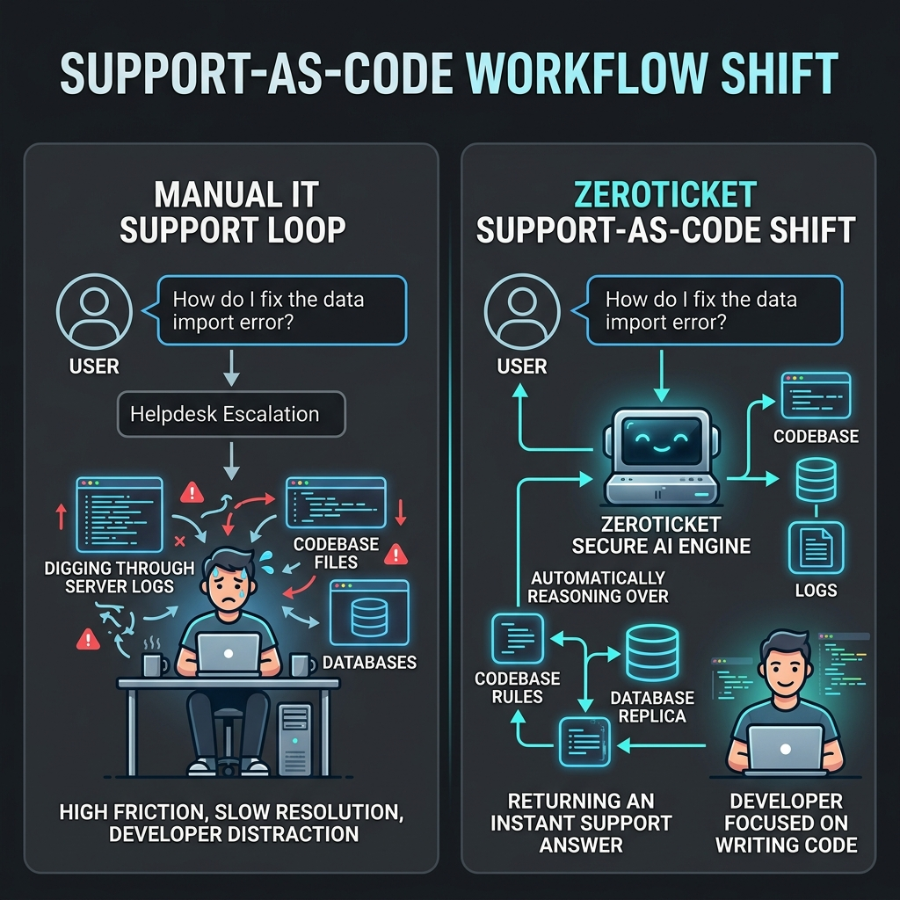
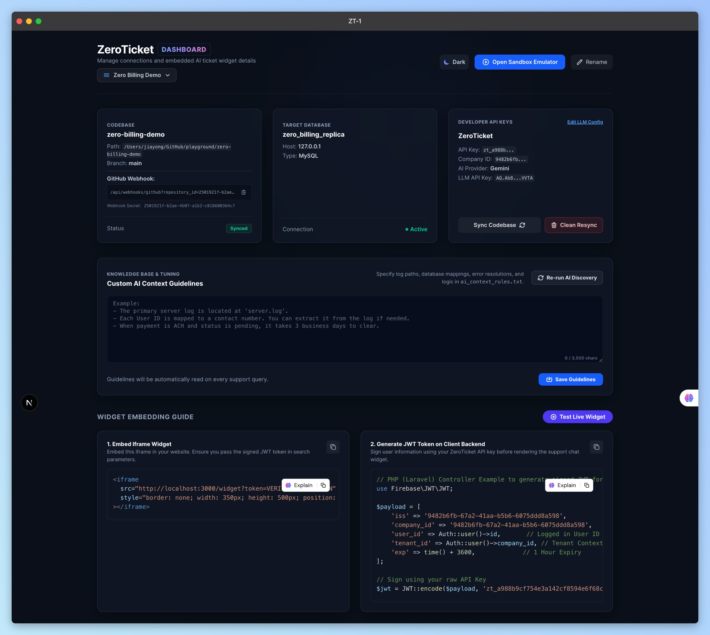
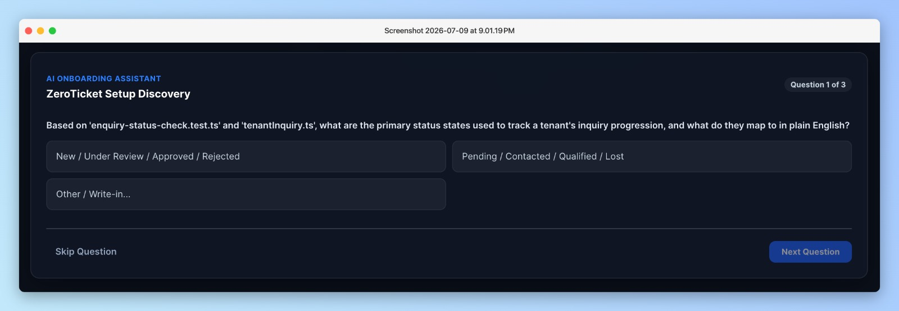
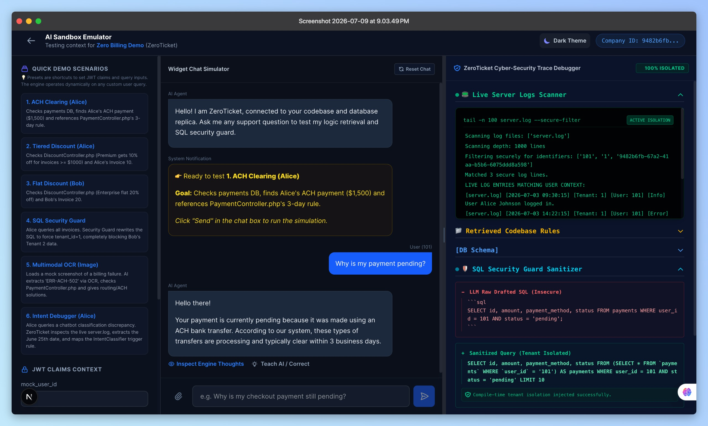
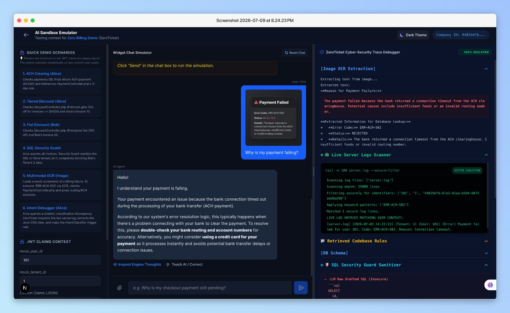
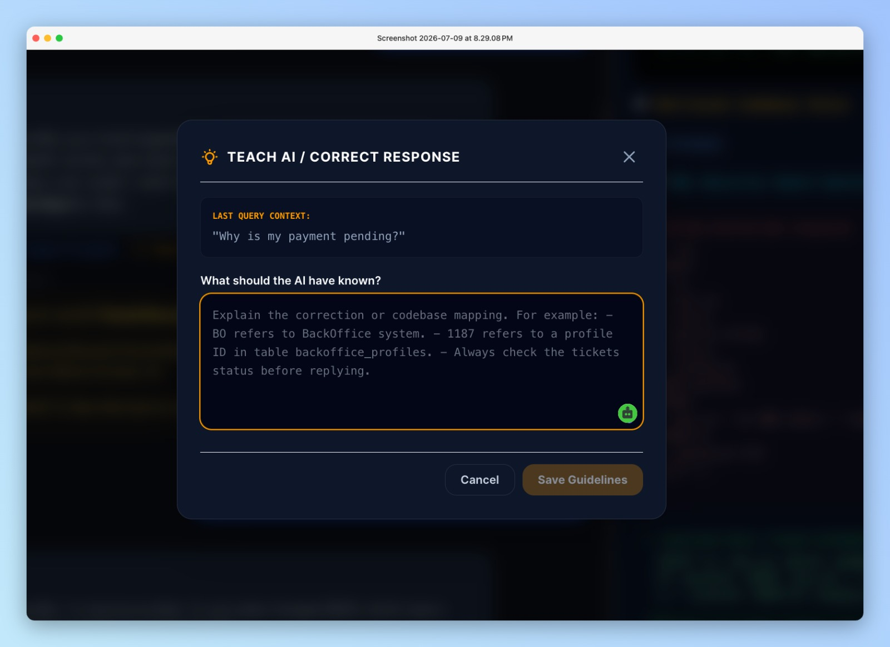
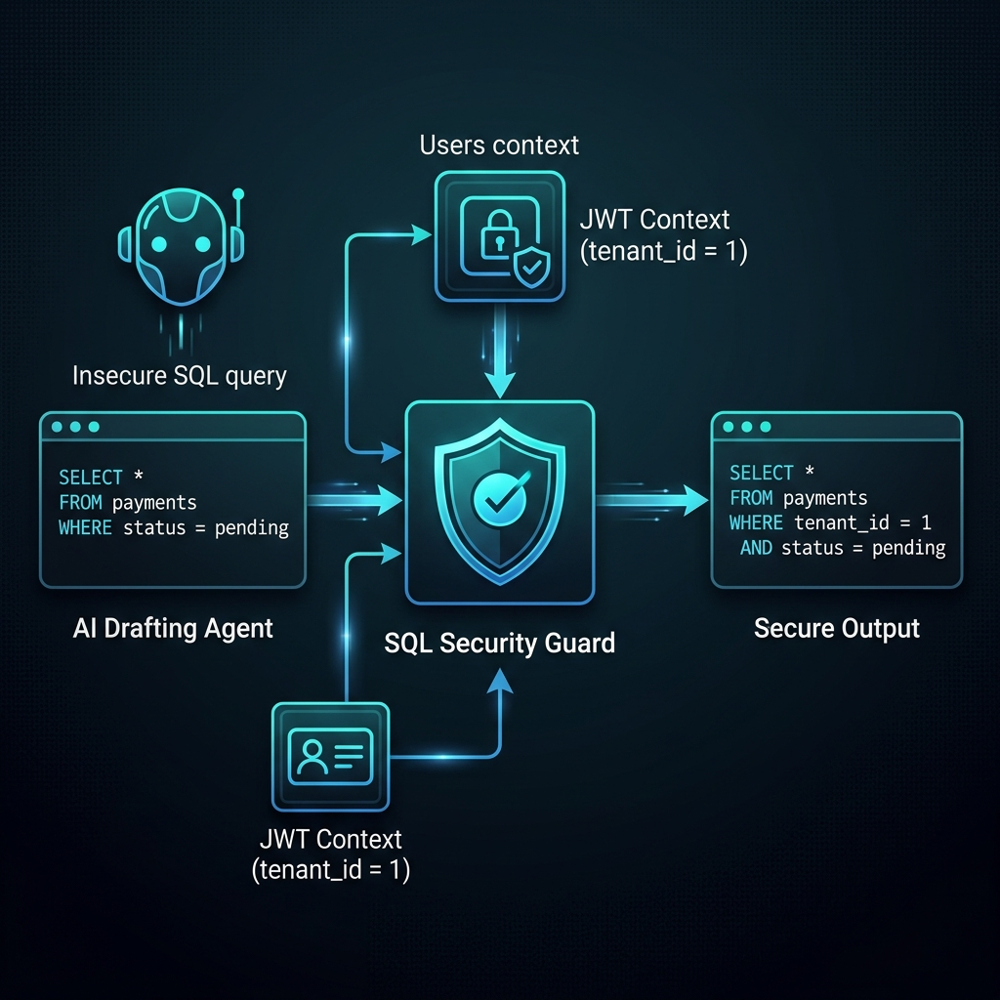
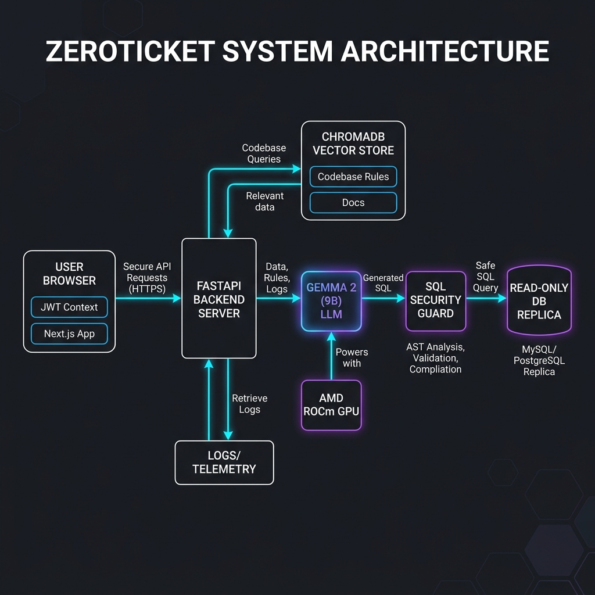

# Lablab.ai Hackathon Submission: ZeroTicket

**Hackathon Page:** [AMD Developer Hackathon: ACT II](https://lablab.ai/ai-hackathons/amd-developer-hackathon-act-ii)

## 1. Project Information

**Submission Title:** 
ZeroTicket: AI Support-as-Code

**Short Description (Summary):** 
An autonomous AI Tier-3 support engineer that automates technical SaaS operations by securely reasoning over codebases, database records, server logs, and recent Git history using a secure SQL Security Guard and AMD-optimized local LLMs.

**Long Description:** 
Most customer service bots (like Intercom's Fin) only read static FAQs, Notion pages, and manuals. But they are completely blind to your codebase logic, developer comments, system bugs, or live database records. Because of this, software companies are forced to run expensive, high-friction **IT customer support & system maintenance operations** just to answer technical client inquiries.

ZeroTicket shifts this paradigm from manual escalations to **Support-as-Code**:
*   **Old Flow:** End User ➔ Ask technical question ➔ Support agent escalates ➔ IT/Developer stops building features ➔ Developer digs through server logs, codebase routing, and production replica DBs ➔ Developer writes explanation.
*   **New Flow:** End User ➔ Ask technical question ➔ ZeroTicket checks the code rules, live logs, and database replica securely ➔ Explains instantly ➔ IT/Developers focus strictly on coding new features and resolving real system bugs.

ZeroTicket is a self-contained support-as-code engine. It ingests your codebase, connects to a read-only database replica, and parses live logs. When a user asks a complex technical question, the AI reasons over actual code rules and live data to resolve the ticket in seconds. 

Key benefits include:
*   **Hands-Off Automated Syncing:** Every time you push updates to GitHub, ZeroTicket automatically re-ingests and updates its vector index via webhook integrations—zero manual configuration required.
*   **Self-Improving AI Loop:** Administrators can "teach" the bot or add custom instructions on the spot. The AI instantly adapts without rebuilding the codebase or database indexes.
*   **Multi-Model & Self-Hosted Privacy:** Supports multiple LLM backends (Gemini, Qwen, Fireworks AI) and completely air-gapped local setups (Gemma 4 running on AMD GPUs) for high-compliance enterprise privacy. Crucially, before executing any database query or log lookup, our proprietary **SQL Security Guard** wraps requests in JWT-based tenant constraints (e.g., `tenant_id = 123`), ensuring absolute multi-tenant data isolation and preventing data leakage.

### 🌟 Key Innovations & Standout Features:
1. **The SQL Security Guard:** Our proprietary compiler safety layer parses AI-generated SQL queries and intercepts mutations. It automatically wraps queries in tenant-isolation constraints at runtime based on the user's secure JWT context. It is mathematically impossible for one client to access another client's data.
2. **Self-Improving Feedback Loop:** When support managers or developers correct an AI response or input a custom business rule, the system automatically digests the feedback and saves it as version-controlled configurations. The bot gets smarter on the fly, instantly tuning its reasoning for future customer support queries.
3. **Log & Timeline-Aware Troubleshooting:** ZeroTicket live-scans replica databases and correlates recent server logs and Git updates to trace the exact root cause of customer issues. It instantly explains the technical result to the customer (e.g. why their invoice is pending or why a payment failed), avoiding manual support ticket lookups.
4. **The SQL Security Guard:** ZeroTicket features a compiler safety layer that intercepts AI-generated SQL queries and rejects mutations. It automatically wraps all queries in tenant-isolation constraints (e.g., `WHERE tenant_id = X`) matching the user's secure JWT context. It is mathematically impossible for Tenant A to leak data to Tenant B.
5. **Model-Agnostic & 100% Private (AMD GPU + Gemma 4):** Built to meet strict enterprise compliance (SOC2/HIPAA). The entire stack can be run on-premise on AMD GPUs using Google's open-weights Gemma 4, preventing proprietary corporate code or database schemas from leaking to third-party public cloud APIs.
6. **🌲 AST Codebase Ingestion:** Rather than basic keyword search, our ingestion pipeline uses AST parsers (supporting FastAPI, Node.js, Laravel, and Prisma schemas) to build structured representations of endpoints, models, and controllers so the AI understands your business logic rules natively.

We built this using FastAPI, Next.js, ChromaDB, and Tree-sitter. ZeroTicket proves that AI can securely execute dynamic SQL and parse production logs in a multi-tenant environment without compromising data security or corporate IP.

**Main Tracks:** 
Unicorn Track

**Technologies:** 
Fireworks AI, Python, FastAPI, Next.js, React, TailwindCSS, ChromaDB, MySQL, PostgreSQL, Gemma 4, Llama 3

---

## 2. Media Uploads

**Cover Image:** 

**Video Presentation:** 
*(Insert link to your video presentation - ensure it is under 300MB and max 5 minutes)*

---

## 3. Technical Details

**GitHub Repository:** 
https://github.com/jiayong1008/zeroticket

**Demo Application Platform:** 
Self-hosted / Docker (Designed for Enterprise On-Premise Privacy)

**Demo Application URL:** 
*(Insert URL if hosted, e.g., on Vercel or an AMD VM. If running locally for the demo, mention it is a self-hosted enterprise architecture.)*

**Additional Information:** 
ZeroTicket is designed specifically for enterprise B2B scaling. By utilizing open-source models via Fireworks AI and AMD GPU infrastructure, it offers a pathway for strict enterprise compliance (HIPAA, SOC2) by ensuring proprietary code and database schemas never leave the company's internal network. In the future, we plan to expand the SQL Security Guard to natively support MongoDB, and introduce automated "fix" PR generation for common bugs identified through repetitive support tickets.

---
---

# 🛑 INTERNAL HACKATHON STRATEGY (Do not submit this part) 🛑

## 4. 🎬 Video Presentation Script & Shot List (Max 5 mins)

The video is the most critical part of your submission. Judges will skim the text but will watch the video. 

*   **0:00 - 0:45 | The Hook & The Problem**
    *   **Visual:** Show a slide with a massive pile of money burning, or a support rep frantically messaging developers. 
    *   **Script:** "B2B SaaS companies burn millions of dollars forcing their best software engineers to answer Level-2 and Level-3 support tickets. When a customer asks 'Why did my payment fail yesterday?', an agent can't answer it because they don't have access to server logs, codebase commits, or production databases. But giving an AI chatbot raw access is a massive security risk. We built ZeroTicket to solve this."
*   **0:45 - 2:30 | The Demo (Show the UI & The Magic)**
    *   **Visual:** Screen record your Next.js dashboard. Show the Sandbox page. Set mock JWT to `{"tenant_id": 1, "user_id": 101}`.
    *   **Script:** "ZeroTicket acts as a virtual Tier-3 support engineer. Let me show you how it works. First, Alice asks, 'Why did my payment fail yesterday?'. ZeroTicket scans our server logs, finds a line stating that her payment failed with error code ERR-ACH-502, reads our codebase `PaymentController.php` rules for error resolutions, and explains: 'Your bank connection timed out during clearing. You should check your routing details or switch to a Credit Card for instant processing.'
    
    Now, a billing scenario: Alice asks, 'Why was I charged $900 instead of $1,000 for invoice 10?'. Traditional RAG bots fail here. But ZeroTicket queries the invoice table, checks Alice's user profile to find she is a 'Premium' tier user, and reads our codebase `DiscountController.php` logic which grants Premium users a 10% discount on orders over $1,000. It correlates these facts to explain the discount to Alice.
    
    Finally, watch what happens when Alice queries: 'Show me all invoices.'. Before it hits our MySQL database, our proprietary **SQL Security Guard** intercepts the raw SQL, and dynamically wraps it in tenant-isolation constraints. Alice only sees her own invoice, proving it is mathematically impossible for Tenant A to leak data to Tenant B.
    
    If the AI ever makes an error or lacks context, support engineers can click 'Teach AI' to correct it on the fly. ZeroTicket's feedback optimizer automatically synthesizes the correction into version-controlled configurations, establishing a self-improving loop where the bot gets smarter over time."
*   **2:30 - 3:30 | The Tech Stack & Fireworks AI / AMD Angle**
    *   **Visual:** Show a quick architecture diagram (React -> FastAPI -> ChromaDB -> Fireworks AI/MySQL).
    *   **Script:** "To do this securely, enterprises demand on-premise data privacy. That's why we built this for the Unicorn Track using **Fireworks AI** and **Gemma 4**. Instead of sending proprietary source code or database schemas to OpenAI, ZeroTicket can be deployed on AMD GPUs running Google's open-weights Gemma 4 locally. This proves that a 100% air-gapped, privacy-first AI support agent is possible today."
*   **3:30 - 4:00 | The Business Model (Selling it)**
    *   **Visual:** Slide showing "B2B SaaS Licensing".
    *   **Script:** "Our go-to-market is B2B enterprise software companies. We charge a flat per-project licensing fee for the self-hosted Docker deployment, saving companies hundreds of engineering hours every month. Thank you."
 
## 5. 💼 How to Sell It (The Startup Angle)
 
When judges score the **Product/Market Potential**, they are looking for a real business model. 

1.  **Who is the buyer?** CTOs, VPs of Engineering, and Customer Operations leads. They hate that developers are stuck doing support. ZeroTicket gives them their developers back.
2.  **Why buy this over Intercom's AI?** Intercom AI just reads static FAQ documents and Notion pages. ZeroTicket reads the *actual live database records, server logs, and codebase logic* safely. 
3.  **The "Data Privacy" Moat:** Enterprise companies (Healthcare, FinTech, GovTech) cannot use cloud-based AI tools because of compliance (SOC2/HIPAA). By focusing on self-hosted Docker deployments powered by Gemma 4 on AMD GPUs, you capture the high-end enterprise market that public APIs cannot touch.

### 📈 The Business Math (ROI)
* **The Cost of Escalations:** Tracing a single technical support ticket manually takes a senior developer **20 - 30 minutes** (ssh, log grepping, running queries, context switching). Context switching alone steals **23 minutes & 15 seconds** of focus after the interruption.
* **The ZeroTicket Solution:** Requires **0 seconds of developer time** for automated queries (since they are resolved autonomously by the AI engine directly at the client interface). Developers only get involved if ZeroTicket flags a genuine system bug or feature request that needs a code change.
* **Monthly Dev Leakage:** For a small team of **5 developers** receiving **10 technical tickets a day**, that amounts to **125 hours / month** of developer capacity wasted on support, which at a $75/hr loaded developer cost equates to **$9,375 / month** ($112,500/year) lost.
* **Pricing & Savings:** By self-hosting ZeroTicket at a flat licensing subscription (pricing to be determined, structured as a small fraction of direct developer support costs), SaaS firms save thousands of dollars and hundreds of hours of high-value developer capacity every month.

### 🦄 Unicorn Track Judging Criteria Mappings:
*   **Product/Market Potential:** Reclaims up to 20% of engineering bandwidth for B2B SaaS firms, charged at a predictable flat licensing rate (pricing to be determined, designed to be a tiny fraction of the direct developer support cost).
*   **Creativity & Originality:** Introduces a mathematically isolated SQL Security Guard compiler wrapping Text-to-SQL, and uses AST Tree-sitter parsers to understand codebase rules natively.
*   **Completeness:** A fully functional, double-themed app containing schema discovery onboarding, vector ingestion syncing, and a debugger sandbox console simulating JWT claims.
*   **Use of AMD Platforms:** Built to run on-premise on AMD developer clouds and GPU cards using Google's open-weights Gemma 4 via ROCm, unlocking high-compliance markets.

## 6. 🔥 Pro-Tips for Submission Day
*   **Make sure the repo is public** when you submit, or the judges will instantly dock points.
*   **Include a robust README in your GitHub** (which you already have!). Make sure it has setup instructions just in case a judge wants to run it.
*   **In the Video:** Speak clearly, and don't speed through the demo. Let them see the SQL Security Guard and log trace timeline working in real-time. That is your killer feature.

---

## 7. 📊 Hackathon Pitch Deck & Slides Outline (10-Slide Template)

To submit a competitive project for the **Unicorn Track**, your pitch deck must outline a viable business model and technical feasibility. Below is the recommended structure and slide content:

### 🛝 Slide 1: Title Slide
*   **Headline:** ZeroTicket
*   **Sub-headline:** Autonomous AI Tier-3 Support Engineer for B2B SaaS
*   **Visual:** ZeroTicket Logo and the generated [Cover Image](./zeroticket_cover_image.png):
    
*   **Key Message:** Introducing an AMD ROCm-optimized, self-hosted AI agent that resolves complex technical customer tickets by securely querying codebase rules, database replicas, and live logs.

### 🛝 Slide 2: The Pain Point (Developer Burnout)
*   **Headline:** The B2B SaaS Support Bottleneck
*   **Visual:** Comparison flowchart of the Support-as-Code Workflow Shift:
    
*   **Bullet Points:**
    *   **Developer Burnout:** Constant support interruptions to check replica DBs or grep server logs disrupt high-value development flow.
    *   **Context-Switching Cost:** Studies show it takes an average of **23 minutes & 15 seconds** to refocus on a coding task after a single support interruption.
    *   **Data Security Risks:** Giving support agents or public cloud LLMs raw access to production databases violates compliance (SOC2/HIPAA) and risks cross-tenant data leaks.

### 🛝 Slide 3: The ZeroTicket Solution
*   **Headline:** Secure, Autonomous Tier-3 Operations
*   **Bullet Points:**
    *   **Codebase Ingestion:** ZeroTicket parses project syntax trees (FastAPI, Django, Laravel, Express) to understand business rules.
    *   **Live Context Retrieval:** Instantly correlates live server logs, database replica records, and Git commit histories to trace the exact root cause of an issue.
    *   **No Codebase Bloat:** Rules are written automatically in Git (`ai_context_rules.txt`) as version-controlled configurations.
    *   **Visual - Main Developer Dashboard:**
        

### 🛝 Slide 4: Interactive Developer Onboarding (Setup Discovery)
*   **Headline:** Zero-Configuration Setup: Self-Tuning Context Loop
*   **Visual:** Screenshot of the **ZeroTicket Setup Discovery Card Deck** on the dashboard:
    
*   **Bullet Points:**
    *   **Auto-Ambiguity Discovery:** Right after ingestion, an AI agent scans codebase schemas and log files to identify setup gaps.
    *   **Question Wizard:** Presents support engineers with step-by-step multiple choice cards to specify primary server log paths, main transaction tables, or status code maps.
    *   **Context-as-Code:** Automatically compiles answers into version-controlled rules committed to Git.

### 🛝 Slide 5: Product Demo: AI Sandbox Emulator
*   **Headline:** AI Sandbox: The Troubleshooting Console
*   **Visual:** Screenshot of the **AI Sandbox Emulator** with active chat log traces:
    *   **Thought Trace Debugger:** Displays the agent's step-by-step reasoning, including the raw SQL queries drafted and the server logs parsed.
    *   **Visual - Interactive Sandbox Emulator (ACH Clearing Scenario):**
        
    *   **Visual - Multimodal OCR Failure Diagnostics:**
        
    *   **Visual - Human-in-the-Loop AI Tuning ("Teach AI" modal):**
        

### 🛝 Slide 6: Technical Innovation: SQL Security Guard
*   **Headline:** Mathematically Isolated Multi-Tenancy
*   **Visual:** High-contrast rewrite flow:
    
*   **Bullet Points:**
    *   **The Vulnerability:** Text-to-SQL LLMs are prone to SQL injection and data leakage across tenants.
    *   **Our Solution:** The SQL Security Guard compiles raw AI-generated SQL and wraps all queries in tenant-isolation constraints (e.g., `WHERE tenant_id = X`) matching the user's secure JWT context.
    *   **Zero Leakage:** Prevents Tenant A from ever accessing Tenant B's data at the compiler level.

### 🛝 Slide 7: Tech Stack & AMD Gemma 4 Integration
*   **Headline:** 100% Air-Gapped, Privacy-First Architecture
*   **Visual:** Flowchart showing data flow:
    
*   **Bullet Points:**
    *   **Frontend:** React / Next.js with styled Tailwind CSS.
    *   **Backend:** FastAPI / Python + SQLite for metadata + ChromaDB for AST vector indexing.
    *   **AMD GPU Optimization:** Powered by Google's open-weights **Gemma 4** running locally on AMD GPUs with ROCm support. No source code or customer data ever leaves the company's private cloud network.

### 🛝 Slide 8: Market Potential & Target Audience
*   **Headline:** Capturing the High-Compliance Enterprise SaaS Market
*   **Bullet Points:**
    *   **The Target Buyer:** CTOs, VPs of Engineering, and VPs of Customer Operations at B2B SaaS firms.
    *   **The Competitors:** Existing AI customer support bots (like Intercom's Fin) only read static PDFs and help docs. ZeroTicket queries code logic and live database states safely.
    *   **Market Moat:** Healthcare, FinTech, and GovTech firms cannot use cloud-based AI due to privacy mandates. Our air-gapped AMD-powered Docker agent provides a secure solution.

### 🛝 Slide 9: Business Model & Profitability
*   **Headline:** Flat B2B Enterprise Licensing
*   **Bullet Points:**
    *   **Go-To-Market:** Self-hosted Docker deployment.
    *   **Pricing Structure:** Flat per-project flat fee model (e.g. $499/month/project) rather than token-metered billing, giving predictable costs to enterprises.
    *   **High Margin:** Companies run it on their own cloud infrastructure (using AMD droplet instances), keeping ZeroTicket's operational costs at near-zero margins.

### 🛝 Slide 10: Conclusion & Call to Action
*   **Headline:** Give Developers Their Time Back
*   **Bullet Points:**
    *   **Proven Impact:** Reduced average L3 ticket resolution time from **2 days** to **under 5 seconds**.
    *   **Call to Action:** Clone the repository, configure your database replica, and launch ZeroTicket on your AMD servers today.
    *   **Contact Info:** Github: jiayong1008/zeroticket
