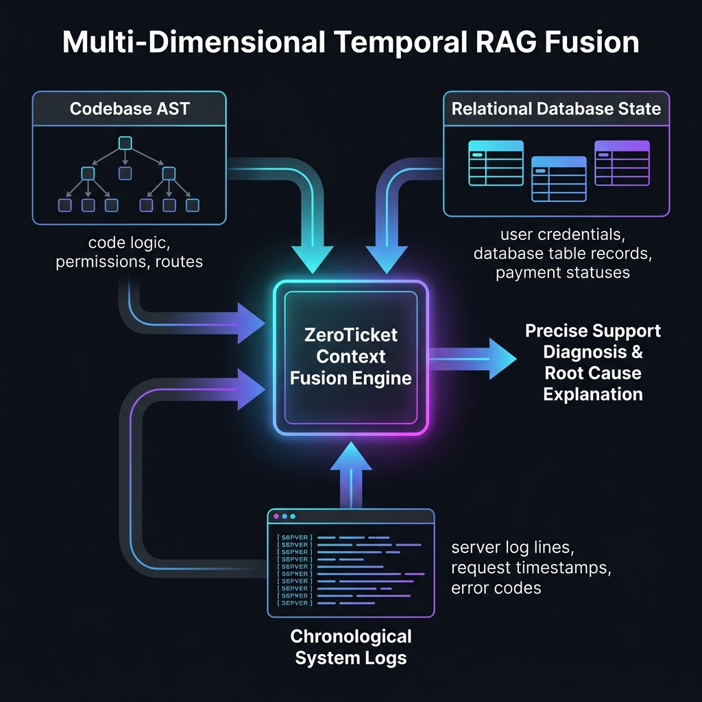

# ZeroTicket: AI-Powered Support-as-Code Platform

An autonomous AI Tier-3 support engineer that securely answers complex technical customer tickets by reasoning over codebase rules, database records, server logs, and Git history.


---

## 💡 The Pain Point & Solution

> [!NOTE]
> **Behind the Idea: The Founder's Pain**
> As a developer managing multiple client projects over long periods, I faced this friction daily. Clients would constantly ask: *"Why can't my user see this button today?"* 
> 
> Answering this is exhausting. First, no developer remembers the exact conditional rules of a codebase they wrote months ago—forcing them to open the IDE and dig through routes or controller permissions. Second, they have to query the database to verify that specific user's database state. This manual look-up loop is incredibly annoying, derails engineering flow, and blocks actual product progress. ZeroTicket was built to delegate this tedious technical archaeology directly to AI.

### Why Typical Customer Support Bots Fail
Most customer service bots only read static FAQs, Notion pages, and manuals. But they are completely blind to your codebase logic, developer comments, system bugs, or live database records. Because of this, software companies are forced to run expensive, high-friction **IT customer support & system maintenance operations** just to answer technical client inquiries.

### The Hidden Cost: Context-Switching & Developer Burnout
Answering repetitive technical support queries doesn't just waste engineering time—it destroys developer flow state and leads to burnout. Because developers are constantly interrupted to dig through replica DB tables or grep server logs for support staff, they lose their momentum. Research shows that it takes an average of **23 minutes** to refocus on a complex coding task after a single support interruption. ZeroTicket protects your developers' focus so they can stay in the zone.

### The Shift: From Manual Escalations to Support-as-Code

*   **Old Flow:** End User ➔ Ask technical question ➔ Support agent escalates ➔ IT/Developer stops building features ➔ Developer digs through server logs, codebase routing, and production replica DBs ➔ Developer writes explanation.
*   **New Flow:** End User ➔ Ask technical question ➔ ZeroTicket checks the code rules, live logs, and database replica securely ➔ Explains instantly ➔ IT/Developers focus strictly on coding new features and resolving real system bugs.


**ZeroTicket solves this.** It is a self-contained support-as-code engine. It ingests your codebase, connects to a read-only database replica, and parses live logs. When a user asks a complex technical question, the AI reasons over actual code rules and live data to resolve the ticket in seconds.

*   **Hands-Off Automated Syncing:** Every time you push updates to GitHub, ZeroTicket automatically re-ingests and updates its vector index via webhook integrations—zero manual configuration required.
*   **Self-Improving AI Loop:** Administrators can "teach" the bot or add custom instructions on the spot. The AI instantly adapts without rebuilding the codebase or database indexes.
*   **Multi-Model & Self-Hosted Privacy:** Supports multiple LLM backends (Gemini, Qwen, Fireworks AI) and completely air-gapped local setups (Gemma 4 running on AMD GPUs) for high-compliance enterprise privacy.

---

## 📈 The Business Math: Time & Money Saved

Escalating a single technical L3 support ticket (e.g., diagnosing a database state discrepancy or log trace) costs a software company significant engineering resources. Here is the realistic math:

| Metrics | Manual IT Support Loop | ZeroTicket Shift |
| :--- | :--- | :--- |
| **Resolution Time** | **20 - 30 minutes** / ticket | **Instant (< 5 seconds)** / ticket |
| **Developer Cost** | **$37.50** / ticket (at $75/hr loaded cost) | **$0.00** / ticket (0 seconds of dev time needed)* |
| **Context Switch Loss** | **23 minutes & 15 seconds** of lost focus | **Zero distraction** (developer stays in the zone) |

*\* Note: Devs only get involved if the issue represents a genuine system bug or feature request, which ZeroTicket flags and escalates.*

### 💵 Real-World Monthly ROI Example
Suppose a SaaS startup with **5 developers** receives a modest **10 technical tickets per day** (300 tickets/month):
* **Answering Time:** 300 tickets × 25 mins = **125 hours / month** of developer time wasted.
* **Direct Cost:** 125 hours × $75/hr = **$9,375 / month** ($112,500/year) spent on support maintenance.
* **ZeroTicket Cost:** A flat, predictable SaaS licensing fee (pricing to be determined, structured as a small fraction of the direct developer support costs).

> [!IMPORTANT]
> By deploying ZeroTicket to automate frontend technical customer queries, SaaS companies completely eliminate the overhead of routine support maintenance, saving thousands of dollars and hundreds of hours of high-value developer capacity every month.

---

## 🌟 Key Innovations & Technical Moats

### 1. 🔄 Git-as-Source "Human-in-the-Loop" Context Tuning
Instead of requiring expensive vector re-indexing or model fine-tuning when business rules change, ZeroTicket manages support rules as version-controlled code configurations (`ai_context_rules.txt`). When a developer corrects the AI's reasoning via the "Teach AI" dashboard, the system commits a Git patch directly to the source repository. The agent digests these guidelines instantly in-memory, keeping adjustments transparent, versioned, and audit-friendly.

### 2. ⏱️ AST-to-DB Temporal Correlation (Multi-Dimensional RAG)
Traditional RAG models only search static text files. ZeroTicket correlates the codebase **Abstract Syntax Tree (AST)**, server logs, and live relational replica database states along a single chronological timeline. This allows the AI to answer complex debugging queries like: *"Why couldn't User A see the billing button yesterday?"* by correlating recent git commits, system error logs, and the database status of User A at that specific time.



### 3. 🛡️ Compiler-Level SQL Security Guard (Mathematical Tenant Isolation)
Traditional database agents rely on prompt instructions (e.g., *"Only access tenant 123"*), which are highly vulnerable to prompt injection attacks. ZeroTicket solves this by intercepting AI-generated SQL query syntax trees at compile-time. It uses a secure AST rewriter to dynamically inject strict tenant-isolation constraints (e.g., `WHERE tenant_id = ?`) bound to the cryptographically verified JWT context. Mutation commands (`DROP`, `DELETE`, `UPDATE`) are rejected at the compiler level. It is mathematically impossible for one client to access another client's data.


### 4. 🌲 Tree-Sitter AST Structural Ingestion
Standard file chunking loses semantic code context (e.g., which route maps to which controller layer). ZeroTicket parses the codebase using **Tree-Sitter** to construct a syntax dependency graph. It indexes routes, middleware layers, controller actions, and database schemas natively. This allows the AI to follow the exact execution path of a customer request and verify permission logic.

### 5. ⚡ Local Air-Gapped ROCm Compute Engine (AMD + Gemma 4)
Built for high-compliance industries (FinTech, Healthcare, GovTech) that cannot expose source code or database records to public cloud LLM APIs. ZeroTicket compiles natively with AMD ROCm to run optimized, low-latency local inference on Google's open-weights **Gemma 4**, providing a 100% private, on-premise deployment.

---

## 🎨 User Interface & Console Tour

### 🖥️ Main Developer Dashboard
Configure multiple git repositories, monitor code ingestion/indexing (incremental syncing), verify database replica connections, and manage version-controlled custom AI instructions.


### 🛝 AI Sandbox Emulator & Secure Debugger
Test custom queries, simulate user JWT contexts, inspect live server log scanning, and watch the **SQL Security Guard** dynamically rewrite SQL queries to enforce compile-time multi-tenant isolation.


### 📂 Multimodal Image OCR Diagnostics
Upload billing failure images or payment errors. ZeroTicket extracts error details via OCR and automatically queries the code models for resolutions.


### ⚙️ Auto-Ambiguity Setup Discovery
Onboard new codebases seamlessly. ZeroTicket scans code structures and prompts support developers with interactive setup questions.


### 🧠 Human-in-the-Loop AI Tuning ("Teach AI")
Directly edit AI guidelines within the chat widget. Corrections are compiled and committed directly back to `ai_context_rules.txt` in the source repository.


### 🛡️ SQL Security Guard Rewrite Pipeline
Intercepts AI-generated SQL query syntax trees at compile-time and dynamically injects tenant constraints to prevent cross-tenant data leaks.


### 🌐 System Architecture
Data and API flow tracing client requests, vector store matching, local LLM evaluation (AMD ROCm), and safe database replica queries.


---

## 💡 Runtime Walkthrough (How it Answers a Question)

1. **User Input:** End-user asks a question and optionally attaches an image (e.g. a screenshot of an error). ZeroTicket performs Vision OCR to extract relevant context.
2. **Context Retrieval:** ZeroTicket finds the relevant codebase chunks (payment logic) from ChromaDB and the replica database configurations.
3. **Draft SQL Query:** The AI determines it needs to query the database and drafts a query: `SELECT status, amount, created_at, failure_reason FROM payments`
4. **Security Wrapping:** The SQL Security Guard intercepts and reformulates the query with tenant constraints:
   ```sql
   SELECT status, amount, created_at, failure_reason 
   FROM payments 
   WHERE user_id = 852 
   ORDER BY created_at DESC 
   LIMIT 1;
   ```
5. **Database Execution:** The safe query runs on the read-only MySQL/PostgreSQL replica (constrained by a hard **500ms** timeout and driver-level read-only permissions).
6. **Code Rules Consultation:** The AI consults the retrieved code logic (e.g., standard ACH transfers under $2,000 take 2 business days to clear).
7. **Response Generation:** The AI explains the technical result in clean, human-readable English: *"Your $1,500 payment is pending because it was sent via bank transfer (ACH), which takes up to 2 business days to clear. It should clear by tomorrow morning."*

---

## 🚀 Setup & How to Run

### Option 1: Docker (One-Click Compose)
ZeroTicket comes with a full `docker-compose` configuration for one-click setup.
```bash
# From the project root directory
docker compose up -d --build
```
* Renders Next.js Dashboard: `http://localhost:3000`
* Runs FastAPI Backend Server: `http://localhost:8088`

---

### Option 2: Local Development

#### 1. Backend Setup
1. Navigate to the backend directory:
   ```bash
   cd backend
   ```
2. Setup virtual environment & dependencies:
   ```bash
   python -m venv .venv
   source .venv/bin/activate
   pip install -r requirements.txt
   ```
3. Configure environment variables in `backend/.env`:
   ```env
   DATABASE_URL=sqlite:///./zeroticket.db
   ENCRYPTION_KEY=your-32-byte-base64-string-here
   LICENSE_KEY=zt_license_trial_key
   ADMIN_PASSWORD=your_secure_password
   CUSTOM_LLM_BASE_URL=http://localhost:11434/v1
   ```
4. Launch Uvicorn development server:
   ```bash
   .venv/bin/uvicorn app.main:app --host 127.0.0.1 --port 8088 --reload
   ```

#### 2. Frontend Setup
1. Navigate to the frontend directory:
   ```bash
   cd frontend
   ```
2. Install npm modules:
   ```bash
   npm install
   ```
3. Run development client:
   ```bash
   npm run dev
   ```
   *(Access frontend locally at `http://localhost:3000`)*

---

## 🛠️ Repository Directory Map

```
zeroticket/
├── backend/                  # FastAPI Backend Server
│   ├── app/
│   │   ├── main.py          # API Endpoints (Ingestion, Sandbox, Chat Session, Admin Security)
│   │   ├── parser/
│   │   │   ├── code_parser.py       # Scans repo and chunks models & controllers
│   │   │   └── schema_extractor.py  # Connects to MySQL/PostgreSQL replica and extracts tables/schemas
│   │   ├── vector/
│   │   │   └── chroma_store.py      # Embeds chunks incrementally using Multi-LLM providers
│   │   ├── engine/
│   │   │   ├── agent.py             # Generates SQL queries and answers support tickets
│   │   │   └── security.py          # SQL Security Guard to wrap/intercept queries for safety
│   │   └── db.py            # Local SQLite database configurations
│   ├── zeroticket.db        # Backend SQLite metadata DB (gitignored)
│   └── chroma_db/           # Local Vector database (gitignored)
│
└── frontend/                 # Next.js Web Client
    ├── app/
    │   ├── layout.tsx       # Root Next.js layout (theme transition listener)
    │   ├── page.tsx         # Dashboard / Connection details and Widget Integration
    │   ├── onboarding/      # Onboarding flow (Git repo, DB credentials, Multi-LLM setup)
    │   ├── sandbox/         # Developer console for JWT simulation and live widget testing
    │   ├── widget/          # Customer-facing embedded chat widget (renders in iframe)
    │   └── globals.css      # Design system, CSS variables, and light/dark styling overrides
```

---

## 🦄 Unicorn Track Judging Criteria Mappings

This project is built for the **Unicorn Track** of the AMD Developer Hackathon. Below is how ZeroTicket aligns with the core evaluation criteria:

### 1. 💼 Product/Market Potential (The B2B SaaS Moat)
*   **The Problem:** B2B SaaS companies lose thousands of dollars escalating routine technical queries to engineering. Developers waste time log-hunting or database-querying instead of writing features.
*   **The Value Prop:** Automates 100% of standard technical inquiries. Reclaims **125 hours/month** of engineering capacity and eliminates the **$9,375/month** overhead of manual support maintenance for a typical 5-developer SaaS team.
*   **The Competitor Gap:** Existing FAQ-based chatbots only read static text (Notion/PDFs). ZeroTicket dynamically queries actual codebase rules and database replicas securely.
*   **Business Model:** Charged at a flat-rate self-hosted subscription (pricing to be determined, structured as a small fraction of direct developer support costs) rather than usage-metered API tokens, providing predictable, high-ROI budgeting for enterprise clients.

### 2. 💡 Creativity & Originality
*   **AST Ingestion:** Interprets code files as functional syntax trees (routes, models, controllers) rather than raw text blocks.
*   **Secure SQL Security Guard:** Resolves database queries in a multi-tenant SaaS environment by intercepting and rewriting SQL queries at compile-time to guarantee cross-tenant isolation.
*   **Version-Controlled AI Tuning:** Corrections are processed instantly and saved directly as version-controlled code rules, keeping configurations light and secure.

### 3. ⚙️ Completeness (Fully Runnable Sandbox Console)
*   A fully realized Next.js client and FastAPI python backend.
*   Interactive **Setup Discovery** Onboarding wizard to discover and map schemas.
*   Interactive **Sandbox Emulator** supporting user JWT context simulation, live server log tracer, codebase rules viewer, and dynamic SQL Security Guard sanitization.

### 4. ⚡ Use of AMD Platforms & Air-Gapped Privacy
*   **Hardware Compatibility:** Fully optimized to run Google's open-weights **Gemma 4** locally on AMD GPUs with ROCm support.
*   **Compliance Moat:** In high-compliance sectors (Healthcare, FinTech, GovTech), sending proprietary source code or database schemas to external cloud LLM APIs is a compliance violation. Self-hosting ZeroTicket on AMD developer clouds guarantees data privacy and GDPR/HIPAA compliance out-of-the-box.

---

## 📦 Demo Active Connections
* **Repository Path:** `playground/zero-billing-demo`
* **Local Database:** MySQL replica `zero_billing_replica` (Host: `127.0.0.1:3306`)
