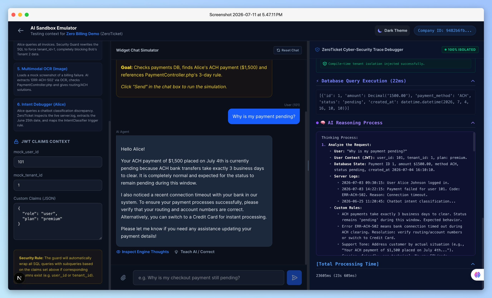
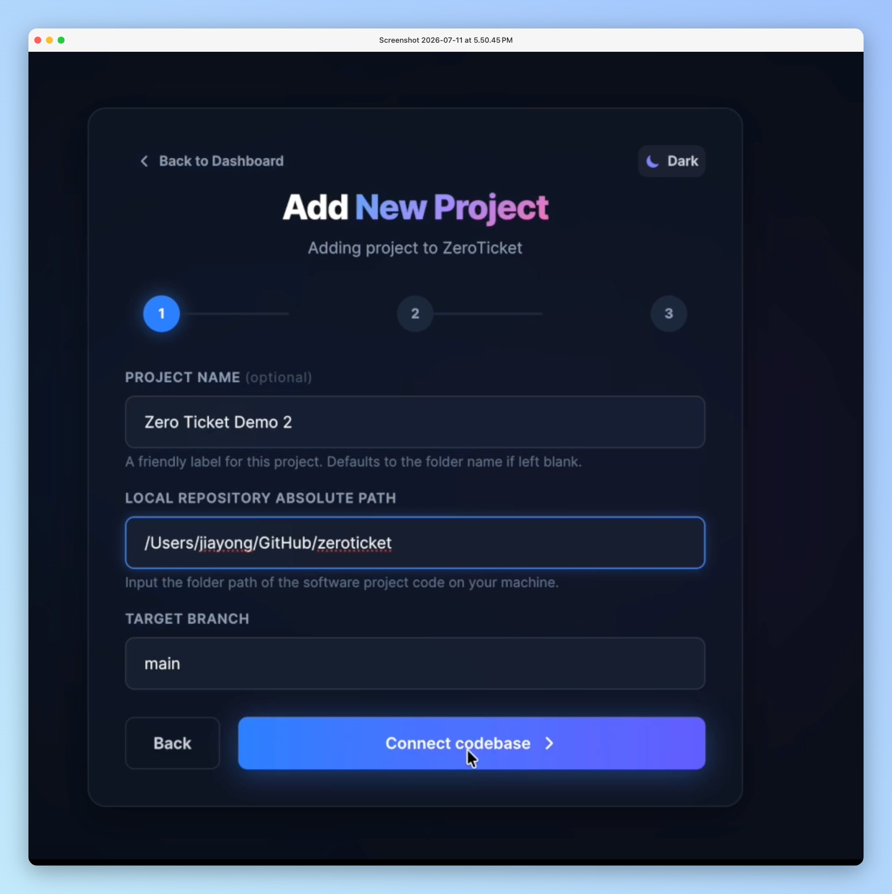
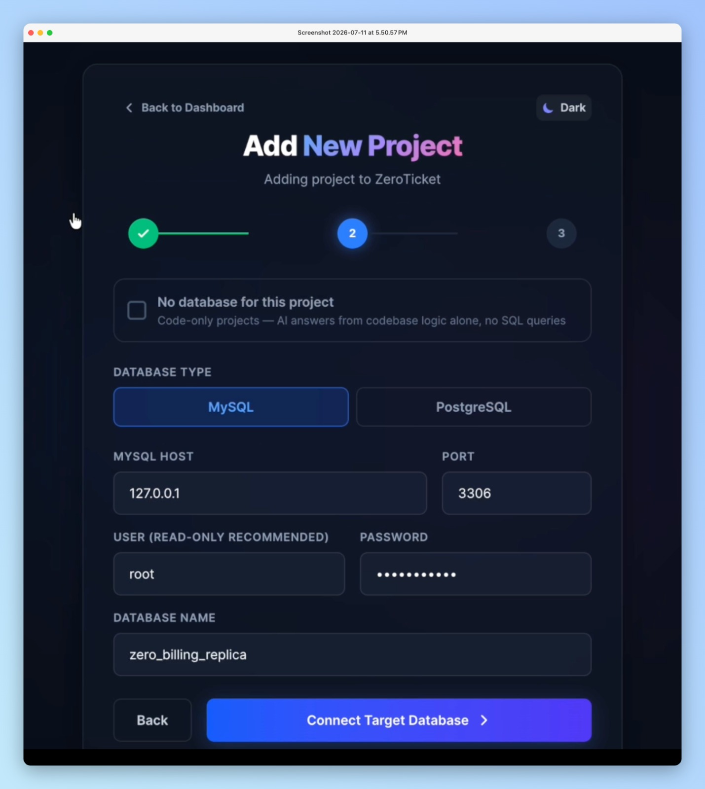
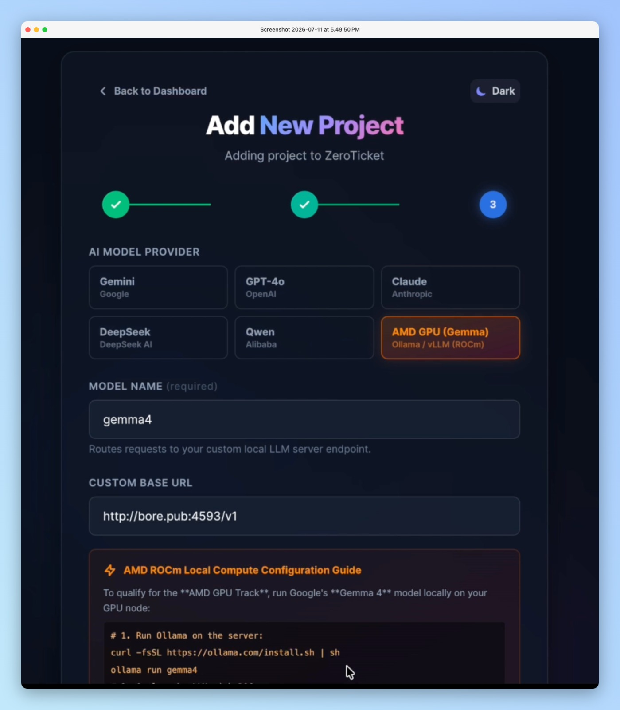

# ZeroTicket: AI-Powered Support-as-Code Platform

An autonomous AI Tier-3 support engineer that securely answers complex technical customer tickets by reasoning over codebase rules, database records, server logs, and Git history.


---

## 🔗 Live Demo & How Judges Can Test It

**Live URL:** [https://zero-ticket.vercel.app](https://zero-ticket.vercel.app)

This is a real, deployed instance — frontend and backend both running on Vercel. Admin/onboarding endpoints are gated behind a passphrase so the live app isn't wide open to the public internet; use the demo credential below to walk through the full flow yourself.

> [!NOTE]
> **Demo admin passphrase:** `zeroticket-demo-2026`
>
> This is a throwaway credential scoped to this demo deployment only — it doesn't protect any real customer data or production secret. Enter it when the onboarding wizard's login screen prompts for the admin passphrase.

**Pre-seeded demo database** — same schema and data as the [zero-billing-demo](https://github.com/jiayong1008/zero-billing-demo) sandbox codebase (`users` with `tenant_id`/`tier`, `payments`, `invoices`), just hosted on Postgres instead of local MySQL so it's actually reachable from the live deployment. Fake data only, safe to query freely:

| Field | Value |
| :--- | :--- |
| Type | PostgreSQL |
| Host | `aws-0-ap-southeast-1.pooler.supabase.com` |
| Port | `6543` |
| User | `zeroticket_demo.imfodooivsiupyoegufq` |
| Database | `postgres` |
| Password | `ZeroTicketDemo2026!` |

> [!NOTE]
> This is Supabase's connection **pooler** (Supavisor), not the direct host — Vercel's Python serverless runtime has no outbound IPv6, and Supabase's direct connection is IPv6-only on the free tier. The pooler is IPv4 and is the correct way to reach any external Postgres from this deployment.

Seeded users: Alice Johnson (`tenant_id=1`, premium tier, pending $1500 ACH payment, invoice #10 discounted from $1000 to $900) and Bob Smith (`tenant_id=2`, enterprise tier, active $45 payment, invoice #20 discounted from $200 to $160).

**Suggested test flow:**
1. Visit the [onboarding wizard](https://zero-ticket.vercel.app/onboarding) and log in with the passphrase above.
2. Register a demo company. On the "Connect codebase" step, enter any public or private GitHub URL `https://github.com/jiayong1008/zero-billing-demo` (or shorthand `jiayong1008/zero-billing-demo`). For private repositories, enter a read-only Personal Access Token (PAT). Note: a local folder path only works if you're running ZeroTicket on your own machine. Then connect the pre-seeded demo database above (PostgreSQL tab) to test the DB-aware Q&A path — or select "No database for this project" to test the code-only path. Pick an LLM provider (Fireworks AI / Qwen 3.7 Plus is fastest for live evaluation, see the Model Provider section below).
3. Try the chat widget or Sandbox Emulator and ask a support question that requires reasoning over both codebase logic and live database state — e.g. *"Why was Alice Johnson's invoice #10 discounted, and is her payment still pending?"*

> [!WARNING]
> **Only use a free-tier / low-quota API key when testing the LLM provider step — never a key tied to real billing.** The admin passphrase above is public in this README, so anyone testing the live demo during the judging window can trigger LLM calls billed to whatever key is configured. Use a free-tier key (Gemini's free tier, or a capped Fireworks AI key) and don't reuse a production or billing-enabled key here.

> [!NOTE]
> **Known limitation on the hosted demo:** the "Teach AI / Correct" guideline-editing feature commits its updated `ai_context_rules.txt` directly back to the source repository via `git`. That requires local, git-writable disk access, which a GitHub-URL-connected repo on Vercel's serverless filesystem doesn't have — it'll fail with a clear error there. It works as designed on the local setup below, where the backend has real filesystem/git access to the repo you point it at.

If anything looks broken when you test it, it's likely a live-deployment quirk rather than the core engine — the full local setup (below, under **Sandbox Demo Testing Project**) is the most reliable way to see every feature end-to-end.

### 📺 1-Minute Video Summary

[](https://youtube.com/shorts/QjWnj3kK5w8)

---

## 💡 The Pain Point & Solution

> [!NOTE]
> **Behind the Idea: The Founder's Pain**
> As a developer managing multiple client projects over long periods, I faced this friction daily. Clients would constantly ask: *"Why can't my user see this button today?"* 
> 
> Answering this is exhausting. First, no developer remembers the exact conditional rules of a codebase they wrote months ago—forcing them to open the IDE and dig through routes or controller permissions. Second, they have to query the database to verify that specific user's database state. This manual look-up loop is incredibly annoying, derails engineering flow, and blocks actual product progress. ZeroTicket was built to delegate this tedious technical archaeology directly to AI.

### Why Typical Customer Support Bots Fail
Most customer service bots only read static FAQs, Notion pages, and manuals. But they are completely blind to your codebase logic, developer comments, system bugs, or live database records. Because of this, software companies are forced to run expensive, high-friction **IT customer support & system maintenance operations** just to answer technical client inquiries.

### The Hidden Cost: Context-Switching & Developer Burnout
Answering repetitive technical support queries doesn't just waste engineering time—it destroys developer flow state and leads to burnout. Because developers are constantly interrupted to dig through replica DB tables or grep server logs for support staff, they lose their momentum. Research shows that it takes an average of **23 minutes** to refocus on a complex coding task after a single support interruption. ZeroTicket protects your developers' focus so they can stay in the zone.

### The Shift: From Manual Escalations to Support-as-Code

*   **Old Flow:** End User ➔ Ask technical question ➔ Support agent escalates ➔ IT/Developer stops building features ➔ Developer digs through server logs, codebase routing, and production replica DBs ➔ Developer writes explanation.
*   **New Flow:** End User ➔ Ask technical question ➔ ZeroTicket checks the code rules, live logs, and database replica securely ➔ Explains instantly ➔ IT/Developers focus strictly on coding new features and resolving real system bugs.


**ZeroTicket solves this.** It is a self-contained support-as-code engine. It ingests your codebase, connects to a read-only database replica, and parses live logs. When a user asks a complex technical question, the AI reasons over actual code rules and live data to resolve the ticket in seconds.

*   **Hands-Off Automated Syncing:** Every time you push updates to GitHub, ZeroTicket automatically re-ingests and updates its vector index via webhook integrations—zero manual configuration required.
*   **Self-Improving AI Loop:** Administrators can "teach" the bot or add custom instructions on the spot. The AI instantly adapts without rebuilding the codebase or database indexes.
*   **Multi-Model & Self-Hosted Privacy:** Supports multiple LLM backends (Gemini, Qwen, Fireworks AI) and completely air-gapped local setups (Gemma 4 running on AMD GPUs) for high-compliance enterprise privacy.

---

## 📈 The Business Math: Time & Money Saved

Escalating a single technical L3 support ticket (e.g., diagnosing a database state discrepancy or log trace) costs a software company significant engineering resources. Here is the realistic math:

| Metrics | Manual IT Support Loop | ZeroTicket Shift |
| :--- | :--- | :--- |
| **Resolution Time** | **20 - 30 minutes** / ticket | **Instant (< 5 seconds)** / ticket |
| **Developer Cost** | **$37.50** / ticket (at $75/hr loaded cost) | **$0.00** / ticket (0 seconds of dev time needed)* |
| **Context Switch Loss** | **23 minutes & 15 seconds** of lost focus | **Zero distraction** (developer stays in the zone) |

*\* Note: Devs only get involved if the issue represents a genuine system bug or feature request, which ZeroTicket flags and escalates.*

### 💵 Real-World Monthly ROI Example
Suppose a SaaS startup with **5 developers** receives a modest **10 technical tickets per day** (300 tickets/month):
* **Answering Time:** 300 tickets × 25 mins = **125 hours / month** of developer time wasted.
* **Direct Cost:** 125 hours × $75/hr = **$9,375 / month** ($112,500/year) spent on support maintenance.
* **ZeroTicket Cost:** A flat, predictable SaaS licensing fee (pricing to be determined, structured as a small fraction of the direct developer support costs).

> [!IMPORTANT]
> By deploying ZeroTicket to automate frontend technical customer queries, SaaS companies completely eliminate the overhead of routine support maintenance, saving thousands of dollars and hundreds of hours of high-value developer capacity every month.

### 💼 How to Sell It (The Startup Angle)
1. **Who is the buyer?** CTOs, VPs of Engineering, and Customer Operations leads who want to reclaim engineering bandwidth.
2. **Why buy this over traditional support bots?** Traditional bots read static FAQ docs. ZeroTicket securely reads actual live database records, server logs, and codebase logic.
3. **The Data Privacy Moat:** Enterprise companies (Healthcare, FinTech, GovTech) cannot use public cloud AI tools due to SOC2/HIPAA compliance. By offering a self-hosted Docker deployment powered by Gemma 4 on AMD GPUs, ZeroTicket captures high-security enterprise markets that public APIs cannot touch.

---

## 🌟 Key Innovations & Technical Moats

### 1. 🔄 Git-as-Source "Human-in-the-Loop" Context Tuning
Instead of requiring expensive vector re-indexing or model fine-tuning when business rules change, ZeroTicket manages support rules as version-controlled code configurations (`ai_context_rules.txt`). When a developer corrects the AI's reasoning via the "Teach AI" dashboard, the system commits a Git patch directly to the source repository. The agent digests these guidelines instantly in-memory, keeping adjustments transparent, versioned, and audit-friendly.

### 2. ⏱️ AST-to-DB Temporal Correlation (Multi-Dimensional RAG)
Traditional RAG models only search static text files. ZeroTicket correlates the codebase **Abstract Syntax Tree (AST)**, server logs, and live relational replica database states along a single chronological timeline. This allows the AI to answer complex debugging queries like: *"Why couldn't User A see the billing button yesterday?"* by correlating recent git commits, system error logs, and the database status of User A at that specific time.


### 3. 🛡️ Compiler-Level SQL Security Guard (Mathematical Tenant Isolation)
Traditional database agents rely on prompt instructions (e.g., *"Only access tenant 123"*), which are highly vulnerable to prompt injection attacks. ZeroTicket solves this by intercepting AI-generated SQL query syntax trees at compile-time. It uses a secure AST rewriter to dynamically inject strict tenant-isolation constraints (e.g., `WHERE tenant_id = ?`) bound to the cryptographically verified JWT context. Mutation commands (`DROP`, `DELETE`, `UPDATE`) are rejected at the compiler level. It is mathematically impossible for one client to access another client's data.


### 4. 🌲 Tree-Sitter AST Structural Ingestion
Standard file chunking loses semantic code context (e.g., which route maps to which controller layer). ZeroTicket parses the codebase using **Tree-Sitter** to construct a syntax dependency graph. It indexes routes, middleware layers, controller actions, and database schemas natively. This allows the AI to follow the exact execution path of a customer request and verify permission logic.

### 5. ⚡ Local Air-Gapped ROCm Compute Engine (AMD + Gemma 4)
Built for high-compliance industries (FinTech, Healthcare, GovTech) that cannot expose source code or database records to public cloud LLM APIs. ZeroTicket compiles natively with AMD ROCm to run optimized, low-latency local inference on Google's open-weights **Gemma 4**, providing a 100% private, on-premise deployment. It natively supports **Ollama** for low-overhead local testing and **vLLM** for scaling up to high-throughput, concurrent multi-user production serving.

### 6. 📚 In-Repo Document RAG & Hybrid Source Citations
Traditional RAG systems only index text, ignoring codebase structure—or index code while ignoring product documentation. ZeroTicket automatically discovers and vector-indexes Markdown user manuals, FAQs, and guides (`.md`, `.txt`, `.rst`) across the entire repository tree. It cross-references static manual rules with live code AST and database replica states, returning inline markdown citations (`[Source 1]`, `[docs/ADMIN_MANUAL.md]`) so users can verify the exact authoritative source of every answer.

### 7. 🔌 Model Context Protocol (MCP) & 4-Tool Engine Architecture
ZeroTicket structures its core capabilities into OpenAPI/MCP-compatible tool schemas:
- 📚 `search_user_manuals`: Vector RAG over Markdown manuals, guides, and FAQs.
- 💻 `search_codebase_ast`: Tree-Sitter AST syntax graph searching across routes, controllers, and models.
- 🔒 `query_database_replica`: Compiler-checked read-only SQL queries protected by SQL Security Guard.
- 📜 `parse_server_logs`: Contextual log scanning correlated with user JWT claims and timestamps.
This modular architecture allows external MCP clients (Notion MCP, Zendesk MCP, Confluence MCP) to connect seamlessly with ZeroTicket's support engine.

---

## 🎨 User Interface & Console Tour

### 🖥️ Main Developer Dashboard
Configure multiple git repositories, monitor code ingestion/indexing (incremental syncing), verify database replica connections, and manage version-controlled custom AI instructions.


### 🛝 AI Sandbox Emulator & Secure Debugger
Test custom queries, simulate user JWT contexts, inspect live server log scanning, and watch the **SQL Security Guard** dynamically rewrite SQL queries to enforce compile-time multi-tenant isolation.


#### 🧠 AI Reasoning Process (Right Panel Trace)
When using reasoning models like Qwen 3.7 Plus, ZeroTicket isolates the step-by-step logic retrieval and displays it in a clean, formatted trace view on the right-hand panel:


### 📂 Multimodal Image OCR Diagnostics
Upload billing failure images or payment errors. ZeroTicket extracts error details via OCR and automatically queries the code models for resolutions.


### ⚙️ Interactive Developer Onboarding
Onboard new codebases, databases, and AI configurations in minutes. ZeroTicket walks you through connecting your repositories and setting up secure database replicas.

| Step 1: Create Company Profile | Step 2: Connect Git Codebase | Step 3: Connect DB Replica & AI |
|---|---|---|
|  |  |  |

### 🧠 Human-in-the-Loop AI Tuning ("Teach AI")
Directly edit AI guidelines within the chat widget. Corrections are compiled and committed directly back to `ai_context_rules.txt` in the source repository.


### 🛡️ SQL Security Guard Rewrite Pipeline
Intercepts AI-generated SQL query syntax trees at compile-time and dynamically injects tenant constraints to prevent cross-tenant data leaks.


### 🌐 System Architecture
Data and API flow tracing client requests, vector store matching, local LLM evaluation (AMD ROCm), and safe database replica queries.


---

## 💡 Runtime Walkthrough (How it Answers a Question)

1. **User Input:** End-user asks a question and optionally attaches an image (e.g. a screenshot of an error). ZeroTicket performs Vision OCR to extract relevant context.
2. **Context Retrieval:** ZeroTicket finds the relevant codebase chunks (payment logic) from ChromaDB and the replica database configurations.
3. **Draft SQL Query:** The AI determines it needs to query the database and drafts a query: `SELECT status, amount, created_at, failure_reason FROM payments`
4. **Security Wrapping:** The SQL Security Guard intercepts and reformulates the query with tenant constraints:
   ```sql
   SELECT status, amount, created_at, failure_reason 
   FROM payments 
   WHERE user_id = 852 
   ORDER BY created_at DESC 
   LIMIT 1;
   ```
5. **Database Execution:** The safe query runs on the read-only MySQL/PostgreSQL replica (constrained by a hard **500ms** timeout and driver-level read-only permissions).
6. **Code Rules Consultation:** The AI consults the retrieved code logic (e.g., standard ACH transfers under $2,000 take 2 business days to clear).
7. **Response Generation:** The AI explains the technical result in clean, human-readable English: *"Your $1,500 payment is pending because it was sent via bank transfer (ACH), which takes up to 2 business days to clear. It should clear by tomorrow morning."*

---

## 🚀 Setup & How to Run

### Option 1: Docker (One-Click Compose)
ZeroTicket comes with a full `docker-compose` configuration for one-click setup.
```bash
# From the project root directory
docker compose up -d --build
```
* Renders Next.js Dashboard: `http://localhost:3000`
* Runs FastAPI Backend Server: `http://localhost:8088`

---

### Option 2: Local Development

#### 1. Backend Setup
1. Navigate to the backend directory:
   ```bash
   cd backend
   ```
2. Setup virtual environment & dependencies:
   ```bash
   python -m venv .venv
   source .venv/bin/activate
   pip install -r requirements.txt
   ```
3. Configure environment variables in `backend/.env`:
   ```env
   DATABASE_URL=sqlite:///./zeroticket.db
   ENCRYPTION_KEY=your-32-byte-base64-string-here
   LICENSE_KEY=zt_license_trial_key
   ADMIN_PASSWORD=your_secure_password
   CUSTOM_LLM_BASE_URL=http://localhost:11434/v1
   ```
4. Launch Uvicorn development server:
   ```bash
   .venv/bin/uvicorn app.main:app --host 127.0.0.1 --port 8088 --reload
   ```

#### 2. Frontend Setup
1. Navigate to the frontend directory:
   ```bash
   cd frontend
   ```
2. Install npm modules:
   ```bash
   npm install
   ```
3. Run development client:
   ```bash
   npm run dev
   ```
   *(Access frontend locally at `http://localhost:3000`)*


## 🧠 Multi-LLM Support — Any Model, Any Provider

ZeroTicket is **model-agnostic by design**. The same codebase RAG pipeline, SQL security guard, and streaming architecture work across every provider below. Simply swap the provider in the dashboard settings — no code changes required.

### 🏎️ Primary Demo Recommendation: Qwen 3.7 Plus (via Fireworks AI)

For live demos and evaluation, we recommend **[Qwen 3.7 Plus](https://fireworks.ai/models/fireworks/qwen3p7-plus)** hosted serverlessly on Fireworks AI:
- ⚡ **Blazing fast** — serverless, no cold starts, streams tokens almost instantly
- 🧠 **Built-in reasoning** — thinks step-by-step before answering (visible in the right-side Trace Debugger panel)
- 👁️ **Vision-capable** — supports the multimodal OCR screenshot test scenario
- 💰 **Ultra cheap** — $0.40/$1.60 per 1M tokens; a typical query costs ~$0.005

**Setup (2 minutes):**
1. Sign up at [fireworks.ai](https://fireworks.ai) and grab your API key.
2. In the ZeroTicket dashboard → **Configure** → select **AMD GPU (Local Gemma)** (Custom provider).
3. Set **Custom Base URL** → `https://api.fireworks.ai/inference/v1`
4. Set **Custom Model Name** → `accounts/fireworks/models/qwen3p7-plus`
5. Paste your API key → **Save Config** → the dashboard shows **AI Provider: Fireworks AI 🟢**

> ⚠️ **Note:** All Gemma models on Fireworks AI are **Dedicated-only** (require paid GPU deployment, ~$1.50–$3/hr). Use the serverless models below for instant access.

**Other serverless models you can experiment with on Fireworks AI** ([browse all →](https://fireworks.ai/models?type=serverless)):

| Model | Fireworks Link | Context | Vision | Price (In / Out per 1M) |
|---|---|---|---|---|
| 🏆 **Qwen 3.7 Plus** *(Recommended)* | [→](https://fireworks.ai/models/fireworks/qwen3p7-plus) | — | ✅ | $0.40 / $1.60 |
| **DeepSeek-V4-Pro** *(1M context window)* | [→](https://fireworks.ai/models/fireworks/deepseek-v4-pro) | 1M | ❌ | $1.74 / $3.48 |
| **DeepSeek-V4-Flash** *(Fastest & cheapest)* | [→](https://fireworks.ai/models/fireworks/deepseek-v4-flash) | 1M | ❌ | $0.14 / $0.28 |
| **Kimi K2.7 Code** *(Code-optimised + vision)* | [→](https://fireworks.ai/models/fireworks/kimi-k2-7-code) | 262k | ✅ | $0.95 / $4.00 |
| **GLM 5.2** *(Function calling + 1M context)* | [→](https://fireworks.ai/models/fireworks/glm-5-2) | 1M | ❌ | $1.40 / $4.40 |
| **Minimax M3** *(Budget-friendly + vision)* | [→](https://fireworks.ai/models/fireworks/minimax-m3) | 512k | ✅ | $0.30 / $1.20 |
| **NVIDIA Nemotron 3 Ultra NVFP4** | [→](https://fireworks.ai/models/fireworks/nemotron-3-ultra-nvfp4) | 262k | ❌ | $0.60 / $2.40 |

💡 With **$50 credit**, a typical ZeroTicket query costs **$0.004–$0.05** → **1,000–10,000+ test runs**.

---

### 🔑 Other Supported Providers (Built-in, no custom URL needed)

| Provider | Models | Select In Dashboard |
|---|---|---|
| **Google Gemini** | Gemini 2.5 Flash, Gemini 2.5 Pro | Select `Gemini (Google)` |
| **OpenAI** | GPT-4o, GPT-4o-mini, o3 | Select `OpenAI` |
| **Anthropic** | Claude 3.5 Sonnet, Claude 3.7 Sonnet | Select `Anthropic (Claude)` |
| **DeepSeek** | DeepSeek Chat, DeepSeek Reasoner | Select `DeepSeek` |
| **Any OpenAI-compatible API** | Ollama, vLLM, LM Studio, Together AI, Groq… | Select `AMD GPU (Local Gemma)` + set Custom Base URL |

---

### 🖥️ Self-Hosted: AMD GPU + Gemma 4 (Hackathon Showcase)

The core use case for the AMD Hackathon — run ZeroTicket **fully offline** on your AMD GPU hardware with no cloud dependency.

To host Google's open-weights **Gemma 4** model locally on your AMD GPU-powered server using ROCm:

#### Option A: Running with Ollama
1. Install Ollama on your AMD server:
   ```bash
   curl -fsSL https://ollama.com/install.sh | sh
   ```
2. Pull and launch the model:
   ```bash
   ollama run gemma4
   ```
   *(Ollama serves the OpenAI-compatible API on port `11434` by default)*

#### Option B: Running with vLLM & ROCm
1. Pull the vLLM Docker container optimized for AMD ROCm:
   ```bash
   docker pull vllm/vllm-openai:rocm
   ```
2. Launch the OpenAI-compatible server:
   ```bash
   python3 -m vllm.entrypoints.openai.api_server \
     --model google/gemma-4-9b-it \
     --port 8000
   ```

#### Option C: Local Embeddings (Fully Air-Gapped)
To compute vector embeddings locally without any cloud API key:
```bash
ollama pull nomic-embed-text
```
*(If local embeddings fail, ZeroTicket auto-falls back to Gemini embeddings if an API key is configured.)*

#### Dashboard Configuration
In the ZeroTicket onboarding flow:
1. Select **AMD GPU (Local Gemma)** as your AI provider.
2. Set **Custom Base URL** → `http://localhost:11434/v1` (Ollama) or `http://localhost:8000/v1` (vLLM).
3. Set **Model Name** → `gemma4` or `google/gemma-4-9b-it`.
4. The **ROCm Connection Status** indicator lights up 🟢 in the dashboard sidebar to confirm the GPU node is reachable.

> [!TIP]
> For a detailed walkthrough on manual installation, persistent storage, bypassing VM firewalls (via Bore/Localtunnel), and running verification tests, see the [AMD GPU Integration Guide](./docs/AMD_GEMMA_INTEGRATION.md).

## 🛠️ Repository Directory Map

```
zeroticket/
├── docs/                     # Project & Hackathon Documentation
│   ├── AMD_GEMMA_INTEGRATION.md  # Local Gemma 4 + AMD ROCm GPU setup guide
│   ├── HACKATHON_SUBMISSION.md   # Hackathon submission form & pitch details
│   ├── PRESENTATION_SLIDES.md    # Clean 10-slide pitch deck presentation outline
│   └── presentation/             # Pitch decks and presentation exports (PPTX, PDF, HTML)
│
├── backend/                  # FastAPI Backend Server
│   ├── app/
│   │   ├── main.py          # API Endpoints (Ingestion, Sandbox, Chat Session, Admin Security)
│   │   ├── parser/
│   │   │   ├── code_parser.py       # Scans repo and chunks models & controllers
│   │   │   └── schema_extractor.py  # Connects to MySQL/PostgreSQL replica and extracts tables/schemas
│   │   ├── vector/
│   │   │   └── chroma_store.py      # Embeds chunks incrementally using Multi-LLM providers
│   │   ├── engine/
│   │   │   ├── agent.py             # Generates SQL queries and answers support tickets
│   │   │   └── security.py          # SQL Security Guard to wrap/intercept queries for safety
│   │   └── db.py            # App metadata DB models (SQLite for local dev, Postgres in production)
│   ├── zeroticket.db        # Backend SQLite metadata DB, local dev only (gitignored)
│   └── chroma_db/           # Local Vector database (gitignored)
│
└── frontend/                 # Next.js Web Client
    ├── app/
    │   ├── layout.tsx       # Root Next.js layout (theme transition listener)
    │   ├── page.tsx         # Dashboard / Connection details and Widget Integration
    │   ├── onboarding/      # Onboarding flow (Git repo, DB credentials, Multi-LLM setup)
    │   ├── sandbox/         # Developer console for JWT simulation and live widget testing
    │   ├── widget/          # Customer-facing embedded chat widget (renders in iframe)
    │   └── globals.css      # Design system, CSS variables, and light/dark styling overrides
```

---

## 📊 Enterprise Capabilities & Platform Alignment

Below is how ZeroTicket aligns with core B2B SaaS architecture, security, and scalability standards:

### 1. 💼 Product/Market Fit (The B2B SaaS Support Moat)
*   **The Problem:** B2B SaaS companies lose thousands of dollars escalating routine technical queries to engineering. Developers waste time log-hunting or database-querying instead of writing features.
*   **The Value Prop:** Automates 100% of standard technical inquiries. Reclaims **125 hours/month** of engineering capacity and eliminates the **$9,375/month** overhead of manual support maintenance for a typical 5-developer SaaS team.
*   **The Competitor Gap:** Existing FAQ-based chatbots only read static text (Notion/PDFs). ZeroTicket dynamically queries actual codebase rules and database replicas securely.
*   **Business Model:** Charged at a flat-rate self-hosted subscription (pricing to be determined, structured as a small fraction of direct developer support costs) rather than usage-metered API tokens, providing predictable, high-ROI budgeting for enterprise clients.

### 2. 💡 Technical Innovation
*   **AST Ingestion:** Interprets code files as functional syntax trees (routes, models, controllers) rather than raw text blocks.
*   **Secure SQL Security Guard:** Resolves database queries in a multi-tenant SaaS environment by intercepting and rewriting SQL queries at compile-time to guarantee cross-tenant isolation.
*   **Version-Controlled AI Tuning:** Corrections are processed instantly and saved directly as version-controlled code rules, keeping configurations light and secure.

### 3. ⚙️ Platform Completeness
*   A fully realized Next.js client and FastAPI python backend.
*   Interactive **Setup Discovery** Onboarding wizard to discover and map schemas.
*   Interactive **Sandbox Emulator** supporting user JWT context simulation, live server log tracer, codebase rules viewer, and dynamic SQL Security Guard sanitization.

### 4. ⚡ Private Infrastructure & Air-Gapped Compliance
*   **Hardware Compatibility:** Fully optimized to run Google's open-weights **Gemma 4** locally on AMD GPUs with ROCm support.
*   **Compliance Moat:** In high-compliance sectors (Healthcare, FinTech, GovTech), sending proprietary source code or database schemas to external cloud LLM APIs is a compliance violation. Self-hosting ZeroTicket on AMD developer clouds guarantees data privacy and GDPR/HIPAA compliance out-of-the-box.

---

## 🚀 Future Roadmap
1. **Cross-Database Support:** Extend the compile-time AST Security Guard to parse and sanitize queries for popular NoSQL databases (e.g., MongoDB, DynamoDB).
2. **Git-Native Auto-Fix PRs:** When ZeroTicket identifies a recurring support ticket caused by a confirmed codebase bug (by correlating server logs to code logic), it will automatically generate and open a GitHub Pull Request with the proposed bug fix for the development team to review.

---

## 📦 Sandbox Demo Testing Project

To run sandbox tests and simulate support scenarios out-of-the-box, clone our pre-configured test codebase:
- **Demo Project Codebase:** [zero-billing-demo](https://github.com/jiayong1008/zero-billing-demo)
- **Local Database Replica:** MySQL `zero_billing_replica` (Host: `127.0.0.1:3306`)


